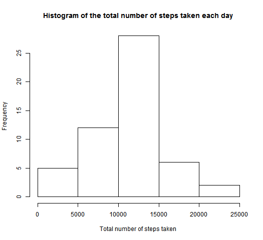
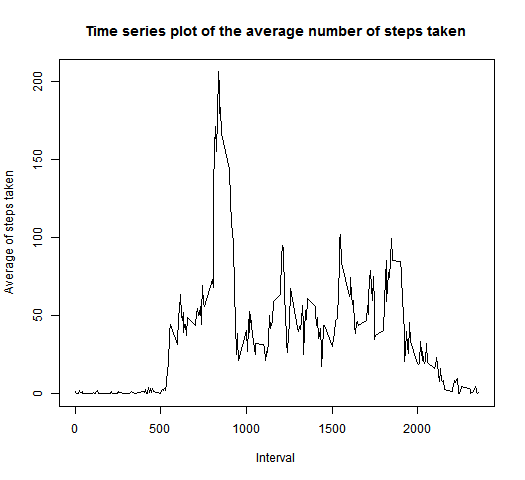
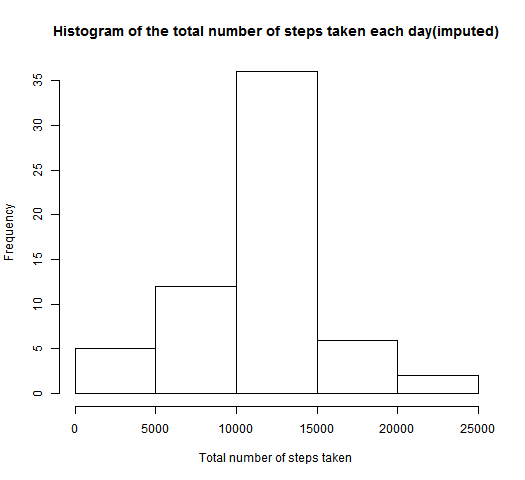
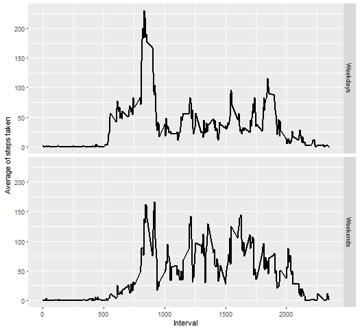

# Reproducible Research: Course Project-I  

## Project Introduction
It is now possible to collect a large amount of data about personal movement using activity monitoring devices such as a Fitbit, Nike Fuelband, or Jawbone Up. These type of devices are part of the “quantified self” movement – a group of enthusiasts who take measurements about themselves regularly to improve their health, to find patterns in their behavior, or because they are tech geeks. But these data remain under-utilized both because the raw data are hard to obtain and there is a lack of statistical methods and software for processing and interpreting the data.

## About Data

This assignment makes use of data from a personal activity monitoring device. This device collects data at 5 minute intervals through out the day. The data consists of two months of data from an anonymous individual collected during the months of October and November, 2012 and include the number of steps taken in 5 minute intervals each day.  

The data for this assignment can be downloaded from the course web site:        
* **Dataset:** [Activity monitoring data    [52K]](https://d396qusza40orc.cloudfront.net/repdata%2Fdata%2Factivity.zip)  

The variables included in this dataset are:<br>
  1. **steps:** Number of steps taking in a 5-minute interval (missing values are coded as **NA**)  
  2. **date:** The date on which the measurement was taken in YYYY-MM-DD format  
  3. **interval:** Identifier for the 5-minute interval in which measurement was taken  

The dataset is stored in a comma-separated-value (CSV) file and there are a total of 17,568 observations in this dataset.  

## Project Setup

```{r global_options}
# Global options to set the visiblity of code and its corresponding output
knitr::opts_chunk$set(echo = TRUE)
```
### Loading packages required for this project
```{r libraries, message=FALSE, warning=FALSE}
# Loading the libraries
library(knitr)
library(dplyr)
library(ggplot2)
```
### Setting the Work Directory
```{r workspace}
# Setting the Workspace
setwd("~DataScience-by-John-Hopkins-University\\5-Reproducible Research\\Week2\\Project2")
```
## Loading the Dataset
```{r reading_data}
#Reading the .csv file
activities <- read.csv(file = "activity.csv",header = TRUE)
```
### Viewing Data and Summary
```{r summary}
# Starting rows of data set
head(activities)
##   steps       date interval
## 1    NA 2012-10-01        0
## 2    NA 2012-10-01        5
## 3    NA 2012-10-01       10
## 4    NA 2012-10-01       15
## 5    NA 2012-10-01       20
## 6    NA 2012-10-01       25
```
```r
# Structure of data set
str(activities)
## 'data.frame':    17568 obs. of  3 variables:
##  $ steps   : int  NA NA NA NA NA NA NA NA NA NA ...
##  $ date    : Factor w/ 61 levels "2012-10-01","2012-10-02",..: 1 1 1 1 1 1 1 1 1 1 ...
##  $ interval: int  0 5 10 15 20 25 30 35 40 45 ...
```
```r
# Summary of data set
summary(activities)
##      steps                date          interval     
##  Min.   :  0.00   2012-10-01:  288   Min.   :   0.0  
##  1st Qu.:  0.00   2012-10-02:  288   1st Qu.: 588.8  
##  Median :  0.00   2012-10-03:  288   Median :1177.5  
##  Mean   : 37.38   2012-10-04:  288   Mean   :1177.5  
##  3rd Qu.: 12.00   2012-10-05:  288   3rd Qu.:1766.2  
##  Max.   :806.00   2012-10-06:  288   Max.   :2355.0  
##  NA's   :2304     (Other)   :15840
```

## Preprocessing the Data
```{r preprocessing}
#Removing the 'NA' Values
activities <- na.omit(activities)
```
## Total number of steps taken per day
```{r sum_of_steps}
# Finding the sum of steps for each day
stepstaken <- aggregate(steps~date,activities,sum)
# Drawing the histogram
hist(stepstaken$steps,xlab="Total number of steps taken",main="Histogram of the total number of steps taken each day")
```
<!-- -->

### Mean of total number of steps taken per day
```{r mean_of_steps}
# Finding the mean of steps for each day
meansteps <- aggregate(steps~date,activities,mean)
# Assigning the Labels
names(meansteps) <- c("Date","Mean of total number of steps taken")
meansteps
```
```r
##          Date Mean of total number of steps taken
## 1  2012-10-02                           0.4375000
## 2  2012-10-03                          39.4166667
## 3  2012-10-04                          42.0694444
## 4  2012-10-05                          46.1597222
## 5  2012-10-06                          53.5416667
## 6  2012-10-07                          38.2465278
## 7  2012-10-09                          44.4826389
## 8  2012-10-10                          34.3750000
## 9  2012-10-11                          35.7777778
## 10 2012-10-12                          60.3541667
## 11 2012-10-13                          43.1458333
## 12 2012-10-14                          52.4236111
## 13 2012-10-15                          35.2048611
## 14 2012-10-16                          52.3750000
## 15 2012-10-17                          46.7083333
## 16 2012-10-18                          34.9166667
## 17 2012-10-19                          41.0729167
## 18 2012-10-20                          36.0937500
## 19 2012-10-21                          30.6284722
## 20 2012-10-22                          46.7361111
## 21 2012-10-23                          30.9652778
## 22 2012-10-24                          29.0104167
## 23 2012-10-25                           8.6527778
## 24 2012-10-26                          23.5347222
## 25 2012-10-27                          35.1354167
## 26 2012-10-28                          39.7847222
## 27 2012-10-29                          17.4236111
## 28 2012-10-30                          34.0937500
## 29 2012-10-31                          53.5208333
## 30 2012-11-02                          36.8055556
## 31 2012-11-03                          36.7048611
## 32 2012-11-05                          36.2465278
## 33 2012-11-06                          28.9375000
## 34 2012-11-07                          44.7326389
## 35 2012-11-08                          11.1770833
## 36 2012-11-11                          43.7777778
## 37 2012-11-12                          37.3784722
## 38 2012-11-13                          25.4722222
## 39 2012-11-15                           0.1423611
## 40 2012-11-16                          18.8923611
## 41 2012-11-17                          49.7881944
## 42 2012-11-18                          52.4652778
## 43 2012-11-19                          30.6979167
## 44 2012-11-20                          15.5277778
## 45 2012-11-21                          44.3993056
## 46 2012-11-22                          70.9270833
## 47 2012-11-23                          73.5902778
## 48 2012-11-24                          50.2708333
## 49 2012-11-25                          41.0902778
## 50 2012-11-26                          38.7569444
## 51 2012-11-27                          47.3819444
## 52 2012-11-28                          35.3576389
## 53 2012-11-29                          24.4687500
```
### Median of total number of steps taken per day
```{r median_of_steps}
# Finding the median of steps for each day
mediansteps <- aggregate(steps~date,activities,median)
# Assigning the Labels
names(mediansteps) <- c("Date","Median of total number of steps taken")
mediansteps
```
```r
##          Date Median of total number of steps taken
## 1  2012-10-02                                     0
## 2  2012-10-03                                     0
## 3  2012-10-04                                     0
## 4  2012-10-05                                     0
## 5  2012-10-06                                     0
## 6  2012-10-07                                     0
## 7  2012-10-09                                     0
## 8  2012-10-10                                     0
## 9  2012-10-11                                     0
## 10 2012-10-12                                     0
## 11 2012-10-13                                     0
## 12 2012-10-14                                     0
## 13 2012-10-15                                     0
## 14 2012-10-16                                     0
## 15 2012-10-17                                     0
## 16 2012-10-18                                     0
## 17 2012-10-19                                     0
## 18 2012-10-20                                     0
## 19 2012-10-21                                     0
## 20 2012-10-22                                     0
## 21 2012-10-23                                     0
## 22 2012-10-24                                     0
## 23 2012-10-25                                     0
## 24 2012-10-26                                     0
## 25 2012-10-27                                     0
## 26 2012-10-28                                     0
## 27 2012-10-29                                     0
## 28 2012-10-30                                     0
## 29 2012-10-31                                     0
## 30 2012-11-02                                     0
## 31 2012-11-03                                     0
## 32 2012-11-05                                     0
## 33 2012-11-06                                     0
## 34 2012-11-07                                     0
## 35 2012-11-08                                     0
## 36 2012-11-11                                     0
## 37 2012-11-12                                     0
## 38 2012-11-13                                     0
## 39 2012-11-15                                     0
## 40 2012-11-16                                     0
## 41 2012-11-17                                     0
## 42 2012-11-18                                     0
## 43 2012-11-19                                     0
## 44 2012-11-20                                     0
## 45 2012-11-21                                     0
## 46 2012-11-22                                     0
## 47 2012-11-23                                     0
## 48 2012-11-24                                     0
## 49 2012-11-25                                     0
## 50 2012-11-26                                     0
## 51 2012-11-27                                     0
## 52 2012-11-28                                     0
## 53 2012-11-29                                     0
```
### Summary of mean and median number of steps taken per day
```{r summary_mean_median}
summary(meansteps)
```
```r
##          Date    Mean of total number of steps taken
##  2012-10-02: 1   Min.   : 0.1424                    
##  2012-10-03: 1   1st Qu.:30.6979                    
##  2012-10-04: 1   Median :37.3785                    
##  2012-10-05: 1   Mean   :37.3826                    
##  2012-10-06: 1   3rd Qu.:46.1597                    
##  2012-10-07: 1   Max.   :73.5903                    
##  (Other)   :47
```
```r
summary(mediansteps)
##          Date    Median of total number of steps taken
##  2012-10-02: 1   Min.   :0                            
##  2012-10-03: 1   1st Qu.:0                            
##  2012-10-04: 1   Median :0                            
##  2012-10-05: 1   Mean   :0                            
##  2012-10-06: 1   3rd Qu.:0                            
##  2012-10-07: 1   Max.   :0                            
##  (Other)   :47
```
## Average daily activity pattern
```{r activity_pattern}
# Finding the average number of steps based on time interval
stepsinterval <- aggregate(steps~interval,activities,mean)
# Plotting the time series plot
plot(stepsinterval$interval,stepsinterval$steps,type = "l",xlab = "Interval",ylab = "Average of steps taken",main ="Time series plot of the average number of steps taken")
```
<!-- -->

### 5-minute time interval which contains the maximum number of steps on average across all the days
```{r max_steps}
# Finding the maximum number steps
maxsteps <- max(stepsinterval$steps)
# Subsetting and finding the interval
subset(stepsinterval,steps==maxsteps)
```
```r
##     interval    steps
## 104      835 206.1698
```
**The interval 835 has the maximum average value of steps i.e 206.1698**

## Imputing missing values
### Total number of missing values in the dataset 
```{r missing_values}
# Reading the Data
activities <- read.csv(file = "activity.csv",header = TRUE)
# Finding the number of missing values
nrow(activities[is.na(activities),])
```
```r
## [1] 2304
```
**Total number of rows with NA’s is 2304.**

### Mean for 5-minute interval is the strategy for filling missing values in the dataset
```{r filling}
# Function to replace all the missing values with mean for 5-minute interval
fillNA <- function()
{
  # Reading the .csv file
  df <- read.csv(file = "activity.csv", header = TRUE)
  # Mean of steps in various time intervals
  si <- aggregate(steps ~ interval, df, mean)
  temp = 0
  # Replacing the 'NA' values with mean of time intervals
  for (i in seq_along(df$steps)) {
    status <- is.na(df$steps[i])
    if (status)
    {
      temp = df$interval[i]
      a <- subset(si, interval == temp)
      df$steps[i] = a$steps
    }
  }
  df
}
```
### Invoking the function to impute 'NA' values
```{r function_call}
# Function call
imputedData <- fillNA()
# First few rows of new data set
head(imputedData)
```
```r
##       steps       date interval
## 1 1.7169811 2012-10-01        0
## 2 0.3396226 2012-10-01        5
## 3 0.1320755 2012-10-01       10
## 4 0.1509434 2012-10-01       15
## 5 0.0754717 2012-10-01       20
## 6 2.0943396 2012-10-01       25
```
```r
# Summary of new data set
summary(imputedData)

##      steps                date          interval     
##  Min.   :  0.00   2012-10-01:  288   Min.   :   0.0  
##  1st Qu.:  0.00   2012-10-02:  288   1st Qu.: 588.8  
##  Median :  0.00   2012-10-03:  288   Median :1177.5  
##  Mean   : 37.38   2012-10-04:  288   Mean   :1177.5  
##  3rd Qu.: 27.00   2012-10-05:  288   3rd Qu.:1766.2  
##  Max.   :806.00   2012-10-06:  288   Max.   :2355.0  
##                   (Other)   :15840
```
### Plotting the histogram using imputed data
```{r sum_steps_imputed_data}
# Finding the sum of steps in imputed data set
imputedsteps <- aggregate(steps~date,imputedData,sum)
# Plotting the graph
hist(imputedsteps$steps,xlab="Total number of steps taken",main="Histogram of the total number of steps taken each day(imputed)")
```
<!-- -->

### Mean of total number of steps taken per day in imputed data
```{r meansteps_imputed_data}
# Finding the mean of steps for each day in imputed data
imputedmean <- aggregate(steps~date,imputedData,mean)
# Assigning the labels
names(meansteps) <- c("Date","Mean of total number of steps taken(imputed)")
imputedmean
```
```r
##          date      steps
## 1  2012-10-01 37.3825996
## 2  2012-10-02  0.4375000
## 3  2012-10-03 39.4166667
## 4  2012-10-04 42.0694444
## 5  2012-10-05 46.1597222
## 6  2012-10-06 53.5416667
## 7  2012-10-07 38.2465278
## 8  2012-10-08 37.3825996
## 9  2012-10-09 44.4826389
## 10 2012-10-10 34.3750000
## 11 2012-10-11 35.7777778
## 12 2012-10-12 60.3541667
## 13 2012-10-13 43.1458333
## 14 2012-10-14 52.4236111
## 15 2012-10-15 35.2048611
## 16 2012-10-16 52.3750000
## 17 2012-10-17 46.7083333
## 18 2012-10-18 34.9166667
## 19 2012-10-19 41.0729167
## 20 2012-10-20 36.0937500
## 21 2012-10-21 30.6284722
## 22 2012-10-22 46.7361111
## 23 2012-10-23 30.9652778
## 24 2012-10-24 29.0104167
## 25 2012-10-25  8.6527778
## 26 2012-10-26 23.5347222
## 27 2012-10-27 35.1354167
## 28 2012-10-28 39.7847222
## 29 2012-10-29 17.4236111
## 30 2012-10-30 34.0937500
## 31 2012-10-31 53.5208333
## 32 2012-11-01 37.3825996
## 33 2012-11-02 36.8055556
## 34 2012-11-03 36.7048611
## 35 2012-11-04 37.3825996
## 36 2012-11-05 36.2465278
## 37 2012-11-06 28.9375000
## 38 2012-11-07 44.7326389
## 39 2012-11-08 11.1770833
## 40 2012-11-09 37.3825996
## 41 2012-11-10 37.3825996
## 42 2012-11-11 43.7777778
## 43 2012-11-12 37.3784722
## 44 2012-11-13 25.4722222
## 45 2012-11-14 37.3825996
## 46 2012-11-15  0.1423611
## 47 2012-11-16 18.8923611
## 48 2012-11-17 49.7881944
## 49 2012-11-18 52.4652778
## 50 2012-11-19 30.6979167
## 51 2012-11-20 15.5277778
## 52 2012-11-21 44.3993056
## 53 2012-11-22 70.9270833
## 54 2012-11-23 73.5902778
## 55 2012-11-24 50.2708333
## 56 2012-11-25 41.0902778
## 57 2012-11-26 38.7569444
## 58 2012-11-27 47.3819444
## 59 2012-11-28 35.3576389
## 60 2012-11-29 24.4687500
## 61 2012-11-30 37.3825996
```
### Median of total number of steps taken per day in imputed data
```{r mediansteps_imputed_data}
# Finding the median of steps for each day in imputed data
imputedmedian <- aggregate(steps~date,imputedData,median)
# Assigning the labels
names(mediansteps) <- c("Date","Median of total number of steps taken(imputed)")
imputedmedian
```
```r
##          date    steps
## 1  2012-10-01 34.11321
## 2  2012-10-02  0.00000
## 3  2012-10-03  0.00000
## 4  2012-10-04  0.00000
## 5  2012-10-05  0.00000
## 6  2012-10-06  0.00000
## 7  2012-10-07  0.00000
## 8  2012-10-08 34.11321
## 9  2012-10-09  0.00000
## 10 2012-10-10  0.00000
## 11 2012-10-11  0.00000
## 12 2012-10-12  0.00000
## 13 2012-10-13  0.00000
## 14 2012-10-14  0.00000
## 15 2012-10-15  0.00000
## 16 2012-10-16  0.00000
## 17 2012-10-17  0.00000
## 18 2012-10-18  0.00000
## 19 2012-10-19  0.00000
## 20 2012-10-20  0.00000
## 21 2012-10-21  0.00000
## 22 2012-10-22  0.00000
## 23 2012-10-23  0.00000
## 24 2012-10-24  0.00000
## 25 2012-10-25  0.00000
## 26 2012-10-26  0.00000
## 27 2012-10-27  0.00000
## 28 2012-10-28  0.00000
## 29 2012-10-29  0.00000
## 30 2012-10-30  0.00000
## 31 2012-10-31  0.00000
## 32 2012-11-01 34.11321
## 33 2012-11-02  0.00000
## 34 2012-11-03  0.00000
## 35 2012-11-04 34.11321
## 36 2012-11-05  0.00000
## 37 2012-11-06  0.00000
## 38 2012-11-07  0.00000
## 39 2012-11-08  0.00000
## 40 2012-11-09 34.11321
## 41 2012-11-10 34.11321
## 42 2012-11-11  0.00000
## 43 2012-11-12  0.00000
## 44 2012-11-13  0.00000
## 45 2012-11-14 34.11321
## 46 2012-11-15  0.00000
## 47 2012-11-16  0.00000
## 48 2012-11-17  0.00000
## 49 2012-11-18  0.00000
## 50 2012-11-19  0.00000
## 51 2012-11-20  0.00000
## 52 2012-11-21  0.00000
## 53 2012-11-22  0.00000
## 54 2012-11-23  0.00000
## 55 2012-11-24  0.00000
## 56 2012-11-25  0.00000
## 57 2012-11-26  0.00000
## 58 2012-11-27  0.00000
## 59 2012-11-28  0.00000
## 60 2012-11-29  0.00000
## 61 2012-11-30 34.11321
```
### Summary of mean and median number of steps taken per day
```{r summary_mean_median_imputeddata}
summary(imputedmean)
```
```r
##          date        steps        
##  2012-10-01: 1   Min.   : 0.1424  
##  2012-10-02: 1   1st Qu.:34.0938  
##  2012-10-03: 1   Median :37.3826  
##  2012-10-04: 1   Mean   :37.3826  
##  2012-10-05: 1   3rd Qu.:44.4826  
##  2012-10-06: 1   Max.   :73.5903  
##  (Other)   :55
```
```
summary(imputedmedian)

##          date        steps       
##  2012-10-01: 1   Min.   : 0.000  
##  2012-10-02: 1   1st Qu.: 0.000  
##  2012-10-03: 1   Median : 0.000  
##  2012-10-04: 1   Mean   : 4.474  
##  2012-10-05: 1   3rd Qu.: 0.000  
##  2012-10-06: 1   Max.   :34.113  
##  (Other)   :55
```
**Mean values stays the same but there is slight difference in median value.**  

## Differences in activity patterns between weekdays and weekends  
### Adding factor variable to find weekdays and weekends
```{r creating_factor_variable}
# Assigning the imputed dataset
newData <- imputedData
# convert to date variable
newData$date <- as.Date(newData$date)
#create a vector of weekdays
weekend_list <- c('Saturday', 'Sunday')
#Use %in% and weekdays to create a logical vector
#convert to factor and specify the levels/labels
newData$days <- factor((weekdays(newData$date) %in% weekend_list), 
         levels=c(FALSE, TRUE), labels=c('weekday', 'weekend'))
# Finding the average number of steps
newinterval <- aggregate(steps~interval+days,newData,mean)
```
### Panel plot of average number of steps in weekdays and weekends 
```{r panel_plot}
# Adding labels for the facets
weeklabels <- c('weekend' = "Weekends", 'weekday' = "Weekdays")
# Drawing graph using ggplot2 package
ggplot(data = newinterval,aes(x = interval, y = steps))+geom_line(size=0.75)+facet_grid(days~.,labeller = as_labeller(weeklabels))+xlab("Interval")+ylab("Average of steps taken")
```
<!-- -->
